# Using Grab n Go

# Managing a Single Device

Devices can be self-managed by using the Grab n Go app which is automatically
installed on enrolled devices. Simply open the Grab n Go app to extend, return,
or mark other device status.

Additionally, use the web app to reach the same self-management interface.

A user is any individual that interacts with the Grab n Go application. Users do
not have administrative permissions and can only manage their own loans. Unlike
a user, a super admin receives administrative permissions by default. The super
admin is in control of configuring the application and experience.

+   Permission may be necessary to complete tasks listed below. Please refer to
    [Grab n Go APIs](gng_apis.md) for granting permission to user(s).

# Managing Devices and Shelves

## Manage a Personal Loan

A user will have the option to manage their personal loan by extending, enabling
guest mode, returning a device, or even reporting the device as damaged or lost.

1.  Access the **My Loans** page in the top left corner of the menu tab located
    at the top of the Grab n Go application homepage. (**My Loans** page is the
    default page when accessing the app)
    

1.  From this page, an assigned loaner can be personally managed by extending,
    enabling guest mode, returning a device, or even reporting it as damaged or
    lost.

## Audit a Shelf

A shelf audit ensures that the loaner device status is accurate and shelves are
in a healthy state by conducting regular inventory counts, tracking the amount
of loans being used each day and confirming that the devices are in working
order so that users can get right to work.

**NOTE**: User must have **Audit_Shelf** permission to audit a shelf.

1.  Access the **Shelves** page in the top left corner of the menu tab located
    at the top of the Grab n Go application homepage.
    
1.  Click the shelf audit icon of the chosen shelf.
    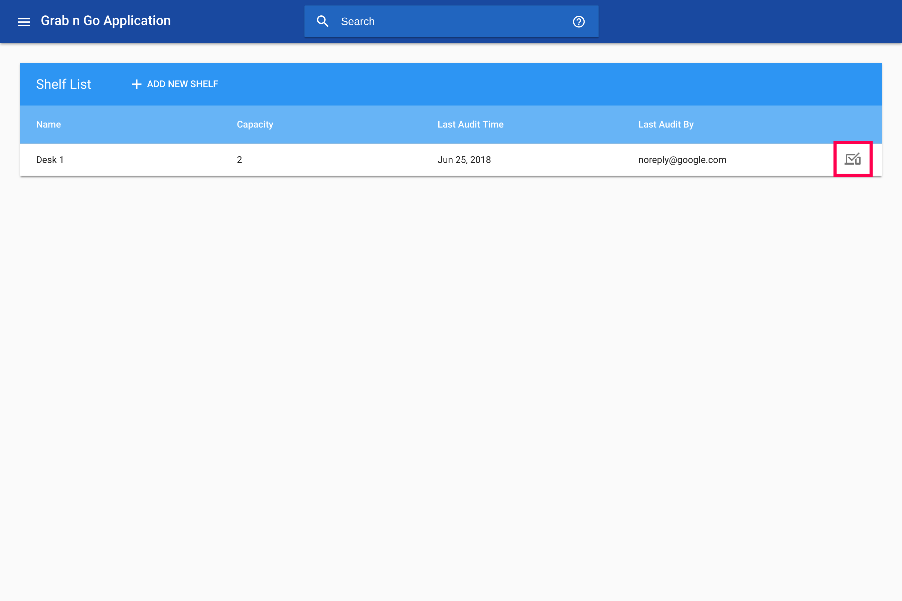
1.  Enter the device identifier in the top right corner of the Grab n Go
    application.
    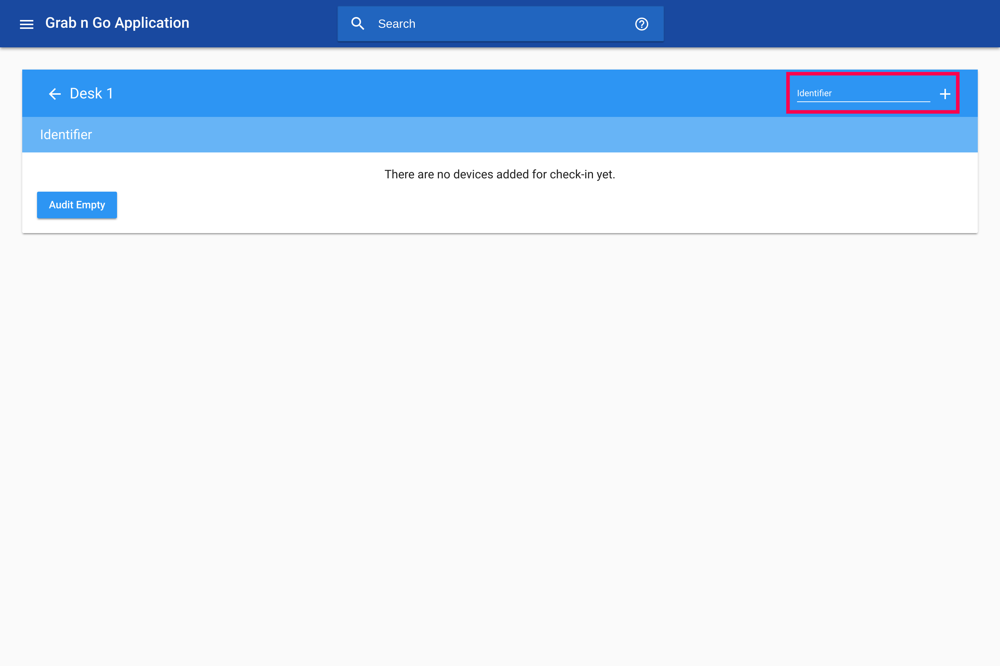
1.  Click add device **+** icon to audit the device within the shelf.

## Add a Shelf

**NOTE**: User must have **Modify_Shelf** permission to add a shelf.

1.  Access the **Shelves** page in the top left corner of the menu tab located
    at the top of the Grab n Go application homepage.
    
1.  Select **ADD NEW SHELF**
    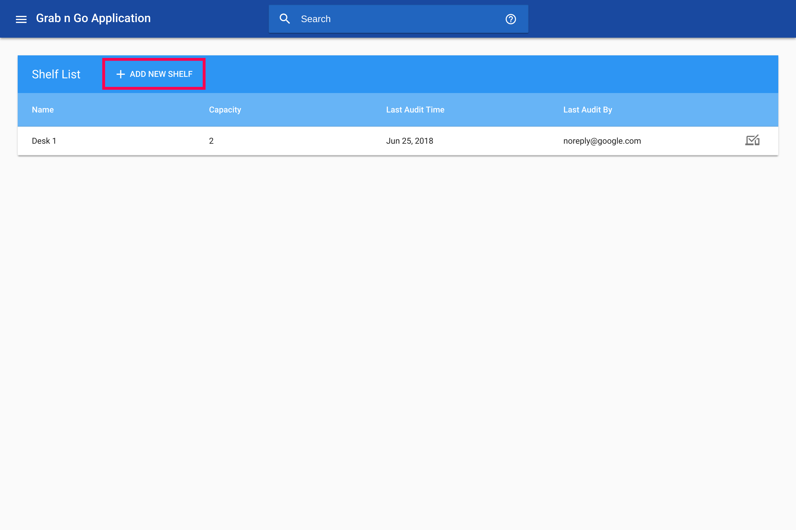
1.  From this page, a new shelf can be configured to have a location, name,
    capacity, and the option to assign a user responsibility to audit.
    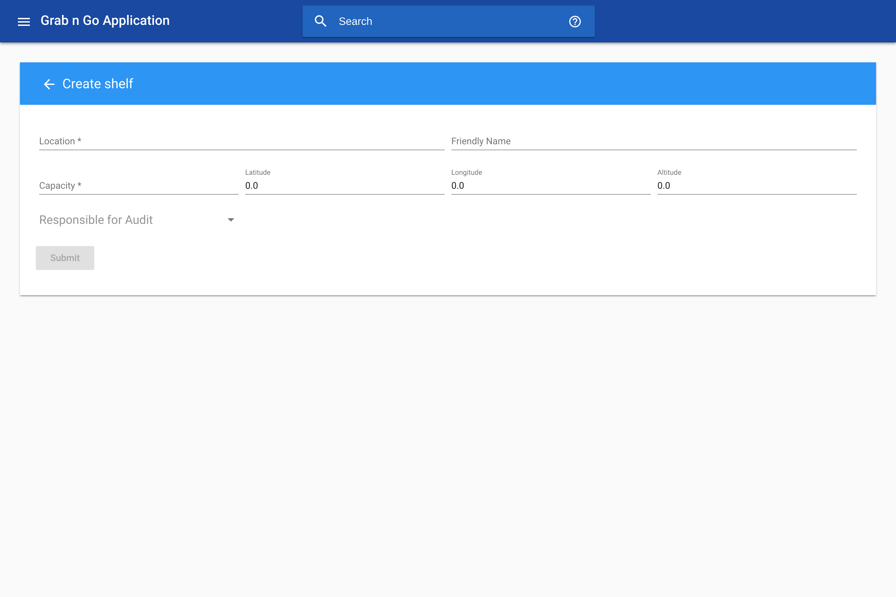

+   Location: Is the unique location to identify a shelf. Ex. Room-G1234
+   Friendly Name: Simplified alternative to the location name. Ex. Green Room

## Remove a Shelf

**NOTE**: User must have **Modify_Shelf** permission to remove a shelf.

1.  Access the **Shelves** page in the top left corner of the menu tab located
    at the top of the Grab n Go application homepage.
    
1.  Select the shelf to delete.
1.  Choose the delete option from the menu selections in the top right corner of
    the Grab n Go application.
    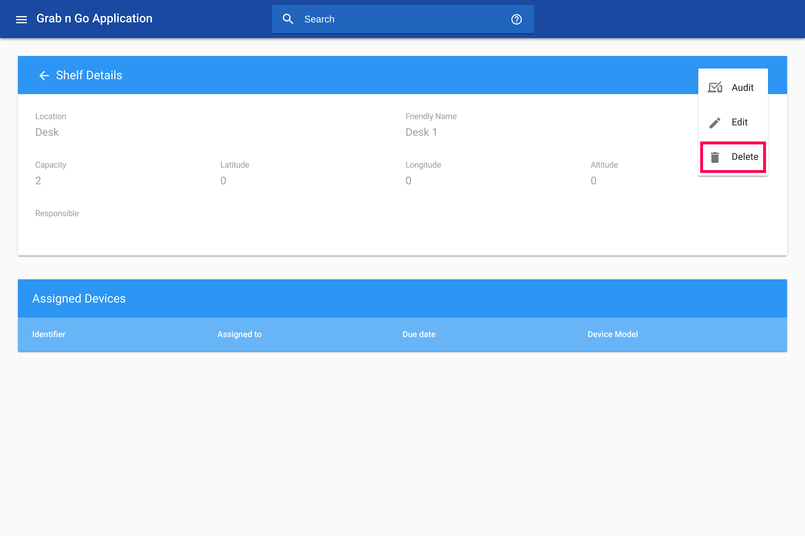

## Edit a Shelf

A shelf edit is necessary if the location, name, capacity, or the user(s)
responsible for the shelf changes.

**NOTE**: User must have **Modify_Shelf** permission to edit a shelf.

1.  Access the **Shelves** page in the top left corner of the menu tab located
    at the top of the Grab n Go application homepage.
    
2.  Select the shelf to edit.
3.  Choose the **Edit** option from the menu selections in the top right corner
    of the Grab n Go application.
    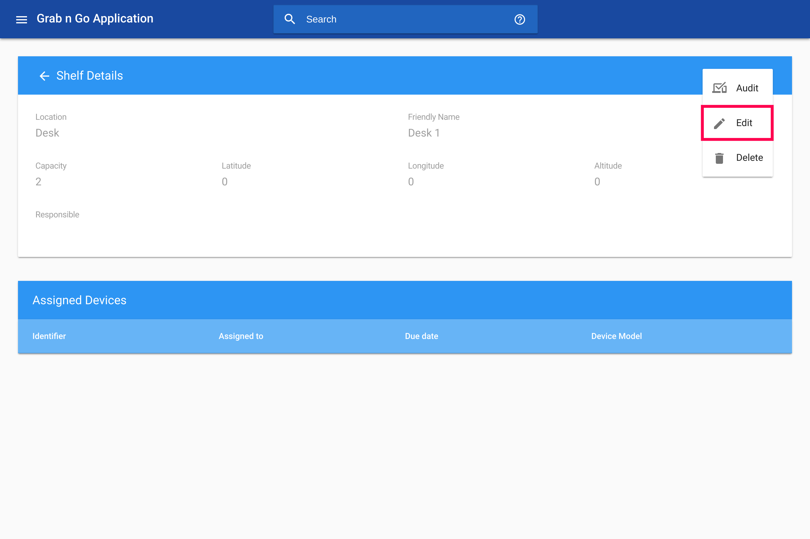
4.  From this page, the location, name, capacity and the option to assign a user
    responsibility to audit can be edited.
    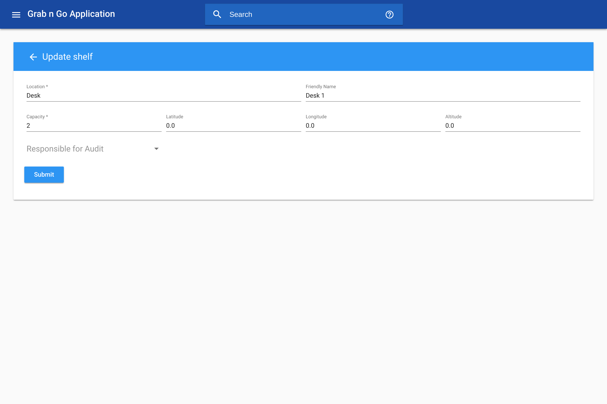

+   Location: Is the unique location to identify a shelf. Ex. Room-G1234
+   Friendly Name: Simplified alternative to the location name. Ex. Green Room

## Add a Device

Adding a device enrolls a device in the program so that it is monitored and
users receive the GnG experience.

**NOTE**: User must have **Modify_Device** permission to add a device.

+   The device should already be
    [enterprise-enrolled](https://support.google.com/chrome/a/answer/1360534?hl=en)
    to the domain.

1.  Access the **Devices** page in the top left corner of the menu tab located
    at the top of the Grab n Go application homepage.
    
1.  Select **ADD NEW DEVICES**.
    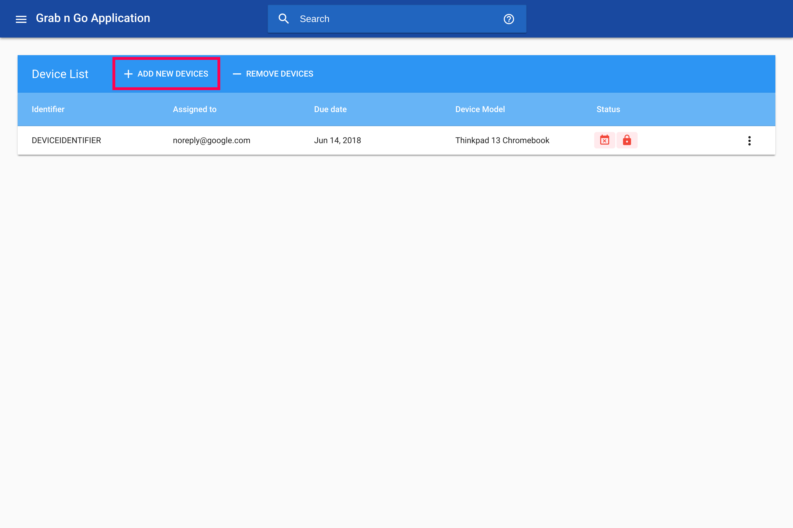
1.  Enter the device identifier to successfully enroll a new device. (Serial
    number or asset tag)
    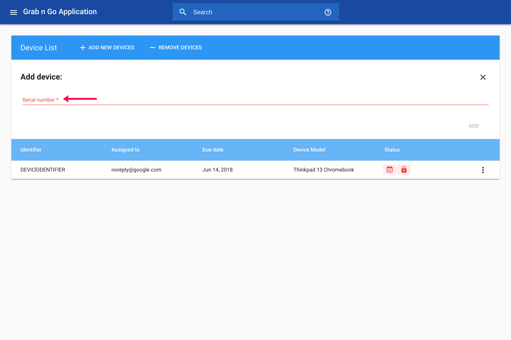
1.  Select **ADD**.
    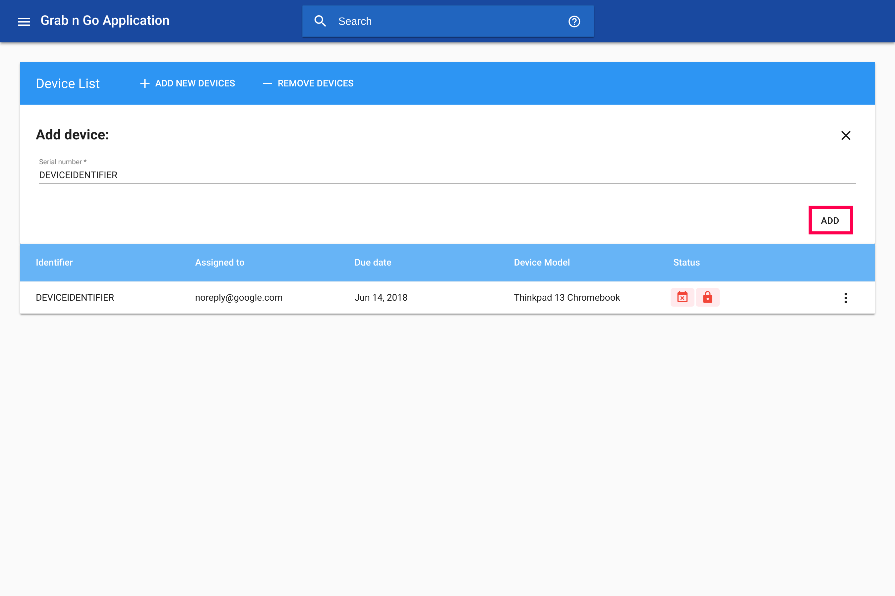

## Remove a Device

The removal of a device unenrolls it from the program, so that it can no longer
be monitored.

**NOTE**: User must have **Modify_Device** permission to remove a device.

1.  Access the **Devices** page in the top left corner of the menu tab located
    at the top of the Grab n Go application homepage.
    
1.  Select **REMOVE DEVICES**.
    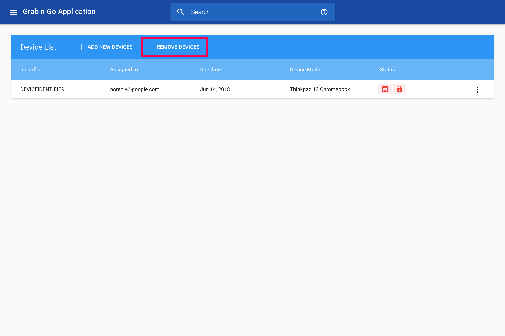
1.  Enter the device identifier to successfully unenroll a device. (Serial
    number or asset tag)
    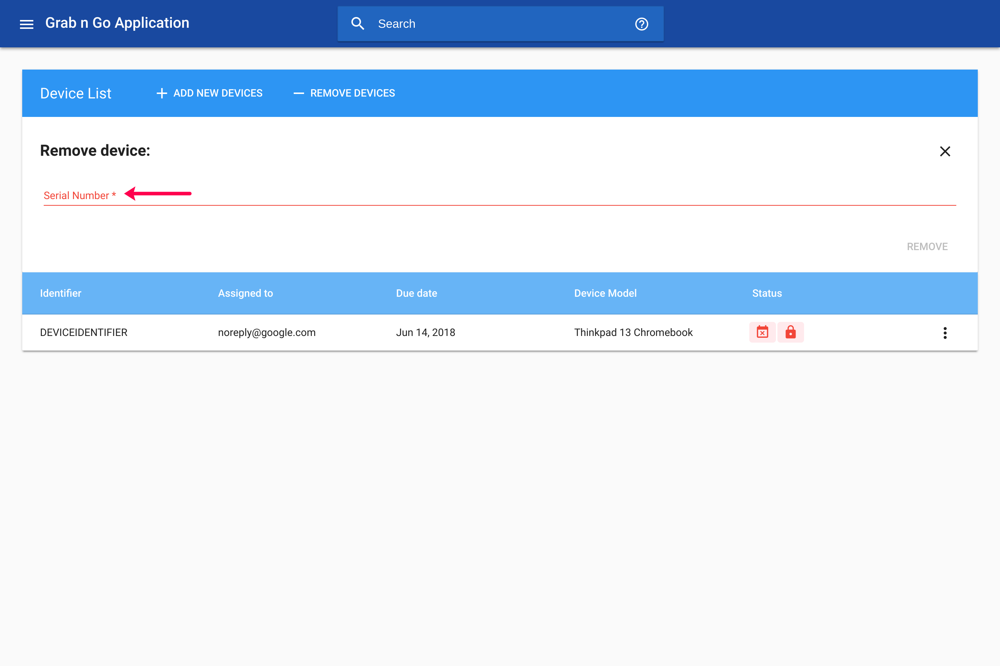
1.  Click **REMOVE** device.
    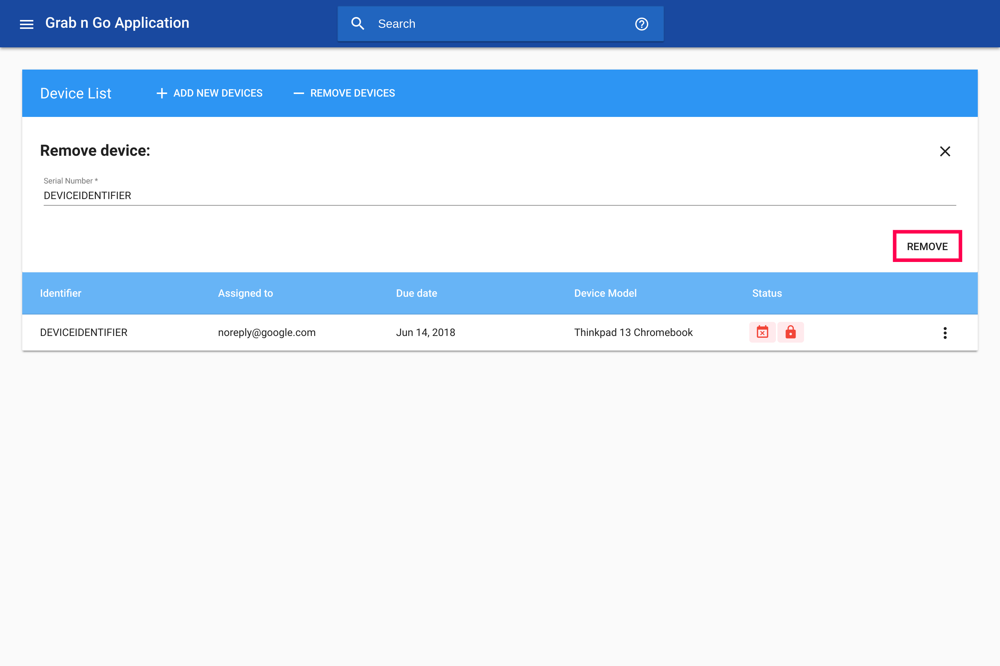

Alternatively:

1.  Access the **Devices** page in the top left corner of the menu tab located
    at the top of the Grab n Go application homepage.
    
1.  Select the appropriate device to unenroll.
1.  Choose the **Unenroll** option from the menu selections.
    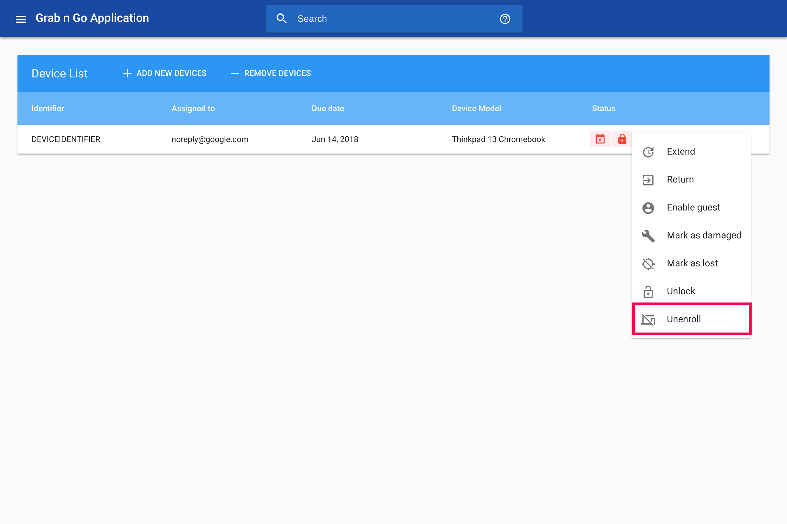

## Get Information About an Enrolled Device

1.  Access the **Devices** page in the top left corner of the menu tab located
    at the top of the Grab n Go application homepage.
    
1.  Select the desired device to view information that includes:

    +   Device model
    +   Asset tag (If there is one)
    +   Who the loaner is assigned to
    +   Current shelf
    +   Current OU
    +   Due date of the loaner
    +   Status of the loaner

## Extend, Return, Enable Guest Mode, and Mark Device Status

1.  Access the **Devices** page in the top left corner of the menu tab located
    at the top of the Grab n Go application homepage.
    
1.  Select the desired device.
1.  Choose the desired action from the menu selections in the top right corner
    of the Grab n Go application.
    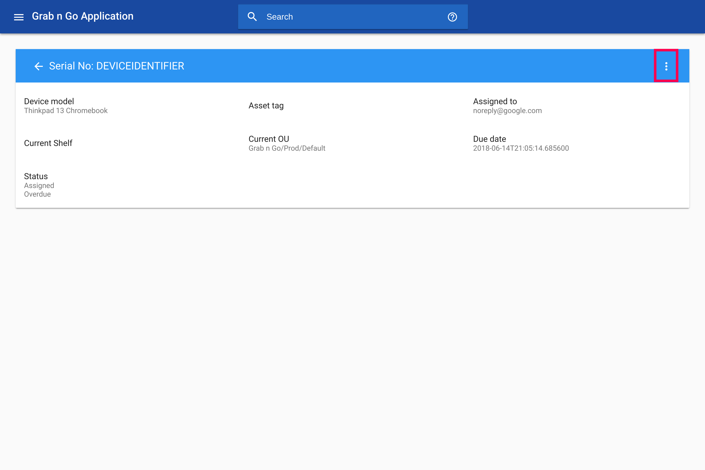
1.  From this page, a loaner can be extended, returned, guest enabled, marked as
    damaged or lost, unlocked, or unenrolled.
    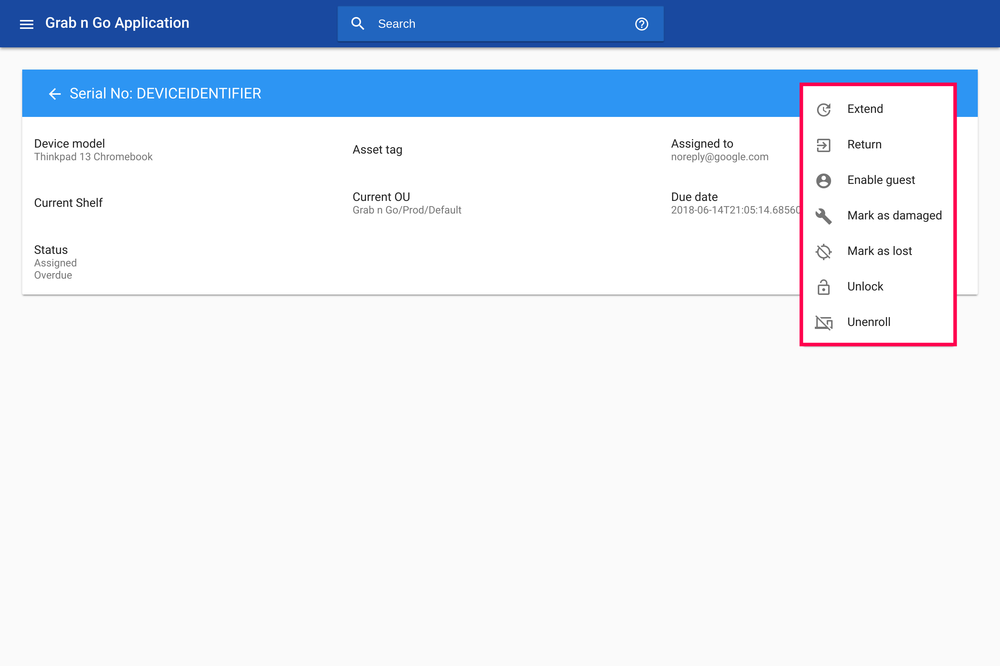
